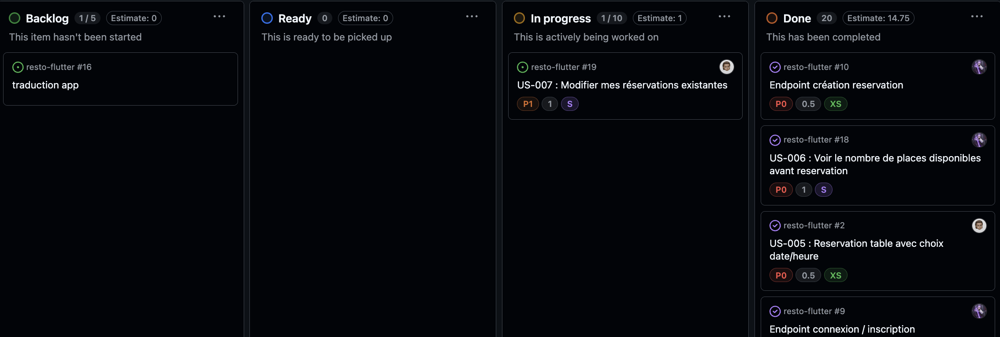
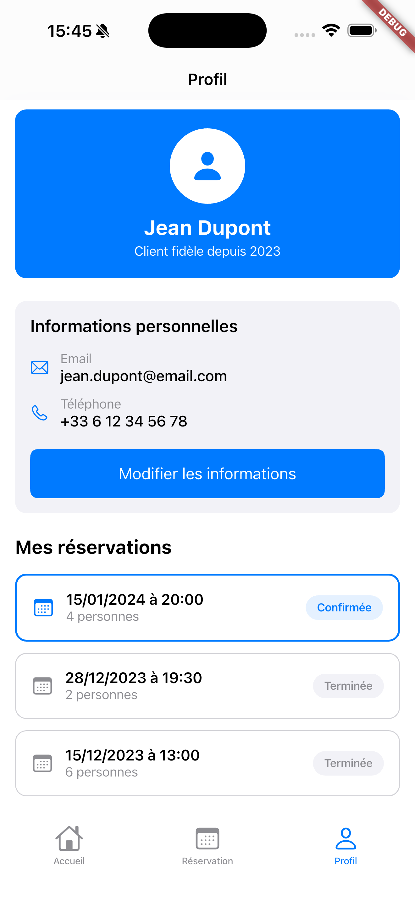

# 📋 Document de Rendu - Restaurant Booking App

**Projet** : Application mobile de réservation de tables de restaurant  
**Cours** : Programmation avec Flutter - ESGI  
**Date de rendu** : Vendredi 07 Novembre 2025

---

## 👥 Informations du Groupe

### Membres du Groupe

| Nom | Prénom | Email | Rôle Principal |
|-----|--------|-------|----------------|
| Boileau | Nathan | n.boileau@myskolae.fr | Full-Stack Developer & Chef Projet |
| Lanone | Maxence | m.lanone@myskolae.fr | Full-Stack Developer |

---

## 🎯 Répartition des Tâches

Voir le Kanban sur le repo GitHub : 

---

## 🔑 Identifiants de Test

### Administrateur - Back-office
```
Email : admin@restaurant.com
Mot de passe : admin
```

---

## 📱 Captures d'écran de l'Application

### 1. Menu du restaurant

**Description :** Écran affichant le menu complet du restaurant avec différentes catégories (Burgers, Pizzas, Salades, Desserts, Boissons). Sous-catégories accessibles via des onglets.

---
### 2. Profile Utilisateur

**Description :** Écran de profil utilisateur affichant les informations personnelles et les réservations.

---

# AJOUTER DES CAPTURES D'ÉCRAN SUPPLÉMENTAIRES SELON LES FONCTIONNALITÉS IMPLÉMENTÉES


## 📊 Board de Gestion de Projet (Trello/Notion)

### Vue d'ensemble du Board


**Description :** Vue globale du board Trello/Notion avec toutes les colonnes de workflow (Backlog, To Do, In Progress, Review, Done).

---

### User Stories - Sprint 1 

**User Stories incluses :**
- ✅ US-001 : En tant qu'utilisateur, je veux créer un compte ou me connecter pour réserver une table ou consulter mes réservations
- ✅ US-002 : En tant qu'utilisateur, je veux voir le menu sans me connecter
- ✅ US-003 : En tant qu'utilisateur, je veux consulter le menu complet
- ✅ US-004 : En tant qu'utilisateur, je veux consulter le menu par catégorie
- ✅ US-005 : En tant qu'utilisateur, je veux réserver une table en choisissant date et heure
- ✅ US-006 : En tant qu'utilisateur, je veux voir le nombre de places disponibles


### User Stories - Sprint 2

**User Stories incluses :**
- ✅ US-007 : En tant qu'utilisateur, je veux modifier mes réservations existantes
- ✅ US-008 : En tant qu'utilisateur, je veux annuler une réservation via l'application
- ✅ US-009 : En tant qu'administrateur, je veux valider ou refuser les demandes de réservation
- ✅ US-010 : En tant qu'utilisateur et admin, je veux recevoir une confirmation par email après une réservation
- ✅ US-011 : En tant qu'utilisateur, je veux localiser le restaurant via une carte interactive
- ✅ US-012 : En tant qu'administrateur, je veux accéder à un back-office pour gérer les réservations et le menu

### User Stories - Sprint 3 (Bonus)

**User Stories bonus incluses :**
- ✅ US-013 : En tant qu'utilisateur, je veux cliquer sur la carte pour ouvrir Apple Maps/Google Maps avec l'adresse
- ✅ US-014 : En tant qu'utilisateur, je veux cliquer sur le numéro de téléphone pour appeler directement
- ✅ US-015 : En tant qu'administrateur, je veux recevoir une notification email à chaque nouvelle réservation
- ✅ US-016 : En tant qu'utilisateur, je veux recevoir un email de confirmation/refus de ma réservation
- ✅ US-017 : En tant qu'utilisateur, je veux profiter d'une interface native iOS (Cupertino)

### Board final après Sprint 2

**Description :** Vue finale du board Trello/Notion après la complétion des deux sprints.